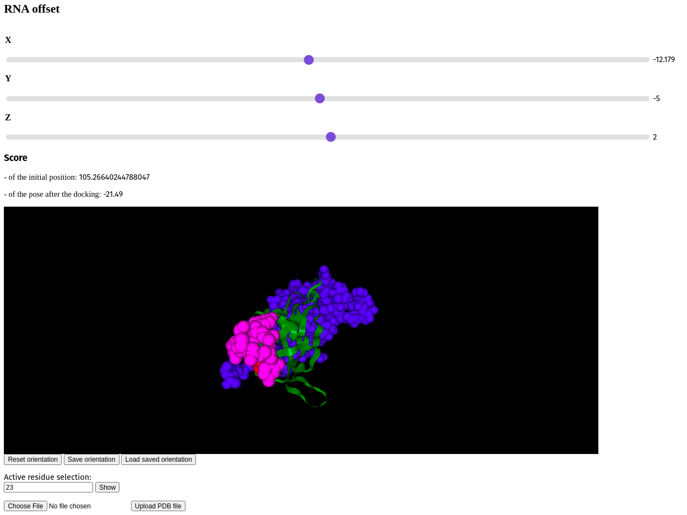

# An interactive workflow to build 3D models of COVID-19 proteins in interaction with RNA

***A crucial function of coronaviruses is their interaction with RNA. Computational methods can build 3D models of this interaction. But they are static workflows that require all relevant scientific data to be specified up-front. For COVID-19, however, new scientific results come in every day. This requires a new kind of workflow: one that can be modified with new scientific data, and where new computations and visualizations can be added and adapted, interactively.***

## Scientific background

SARS-CoV-2 and related coronaviruses are RNA viruses, and interacting with RNA is crucial to their function. In particular, the Nsp9 protein is involved in viral genomic RNA reproduction and interacts with single stranded RNA. Understanding the details of this interaction may help us to understand how SARS-CoV-2 works, helping in the fight against COVID-19.

It is difficult to obtain the 3D coordinates of a protein-RNA molecular complex by experiment. However, a 3D model can be predicted computationally from protein and RNA separately, which is called **molecular docking**. In molecular docking, it is possible to incorporate scientific data on the interaction (**data-driven docking**) into the predictions. ATTRACT is an engine for molecular docking that includes support for protein-RNA complexes and data-driven docking. It includes many parameters that can be optimized to obtain the best possible docking result. ATTRACT’s web interface generates a static pipeline for docking two molecules, essentially a shell script, that has to be run by the user on a machine with an installed ATTRACT docking engine. Currently, ATTRACT pipelines are rigid: modifications of the pipeline cannot be made without first interrupting its work, often with loss of results. Consequently, the occurrence of new information requires replacement of the current pipeline, which is time-consuming and inconvenient.

With the current pandemic, COVID-19 is a very active topic of scientific research. Every day, new research results on COVID-19 and the SARS-CoV-2 virus are published. This makes the docking of Nsp9-RNA a moving target. At any time, scientists can collect the best available scientific data, and create an optimal docking workflow. However, when new data comes in, the new optimal docking workflow may be very different. This requires a more agile kind of workflow: a workflow that the scientific community, in a reproducible and collaborative manner, can easily adapt.

## Project goals

The project aims to create such a workflow. More specifically:

1. **Scientific aspect**. To collect the current scientific information (literature, predictions) regarding the Nsp9-RNA interaction.

2. **Workflow aspect**. To design and implement a data-driven docking workflow that optimally takes into account this information. The static pipelines, created by the ATTRACT’s web-interface are taken as a baseline, which will be further adapted.

3.** Agility aspect**. To allow users to track workflow execution in real-time, customize and adapt it to new scientific results. This consists of two parts. On the one hand, a **web interface **will be created to modify the input data, aimed at users with no programming experience, primarily biologists.

Interaction with the web interface includes the following actions:

*   changing the structure of one or both constituents;
*   changing the initial position of the structures (for the docking of 1 RNA structure);
*   changing the restraints mode;
*   updating information about the binding site of the protein;
*   updating information interface and/or contact points of both protein and ssRNA.

In addition, experts in molecular docking will be able to redesign and reprogram any part of the workflow. Both the web interface and the workflow reprogramming are **interactive** and **collaborative**: multiple users can make modifications simultaneously, and while being modified, the workflow will continue to run while being modified.

## Seamless

As the foundation of the project, ATTRACT pipeline components are integrated into a workflow via the programming framework [Seamless](http://sjdv1982.github.io/seamless/sphinx/html/introduction.html#installation). In Seamless, the workflow is continuously executed while being defined. Data, source code and web interface are all part of the same workflow and can all be changed on the fly. Seamless also provides pipeline visualisation, a Status graph (fig. 2), which allows tracking pipeline execution in real-time. Each pipeline component is presented as a cell, individual bubble, which requires a certain input and provides output after the execution of programmed actions. Execution of action commences automatically as soon as input info is available or updated. In addition, Status graph provides a graphic illustration of the overall progress of the project.

In Seamless, workflows are (re)designed interactively using an IPython console. The Seamless cells of the workflow (data and source code) are mounted to text files that are edited. During work sessions, both IPython console and text files are shared via [Visual Studio Code Live Share](https://visualstudio.microsoft.com/services/live-share/) for real-time collaborative programming.

## Current state of the project

## Fig. 1 - The current state of the web interface

Fig. 2 - Status graph of the project from the 20.07.2020. Pipeline execution is reflected by the change of colour. The blue cells are not affected by the updated information, the green ones are the running cells, orange - awaiting for the input, and red - empty or have an error. Here the RNA offset was changed. An update of values occurs immediately, due to which cells trinucl_offset_x/y/z and trinucl_offset do not change their colour on the graph and one can see the changes only in trinucl_offset and trinucl_offset2.

<!-----
NEW: Check the "Suppress top comment" option to remove this info from the output.

Conversion time: 0.322 seconds.

Using this Markdown file:

1. Paste this output into your source file.
2. See the notes and action items below regarding this conversion run.
3. Check the rendered output (headings, lists, code blocks, tables) for proper
   formatting and use a linkchecker before you publish this page.

Conversion notes:

* Docs to Markdown version 1.0β29
* Thu Jul 23 2020 01:23:48 GMT-0700 (PDT)
* Source doc: Untitled document
----->

We have come quite far in our development at the moment. 7 weekly meetings have been held and significant progress was made. The preliminary pipeline is ready. The current state of the project allows users to collaboratively view the structure of a molecule, which can be moved (shifted, rotated, zoomed). An arbitrary number of the active residues of the protein binding site can be selected by one of the users and others are able to see these actions. After each alteration docking for current molecules (protein and 1 structure of ssRNA) is done automatically, and users are able to see the resulting 3D structure and its score.

Here is a list of the current achievement:

1. In the scientific branch information was collected about:
*   conserved residues Arg-10, Lys-52, Trp-53, Arg-55, Arg-74, Phe-75, Lys-86, Tyr-87, Phe-90, Lys-92, Arg-99, and Arg-111 ([source](https://www.pnas.org/content/101/11/3792));
*   conserved residues F73, L86, F88, I95, G98, and G102 ([source](https://doi.org/10.1002/pro.3150)), where F73, I95, and G98 are found to be critical for stabilizing the dimeric conformation of nsp9 and for nsp9 to bind RNA.
2. A preliminary pipeline was built, docking between protein and ssRNA structures is implemented successfully:
*   Docking is implemented between the rigid fixed protein structure and 1 ssRNA structure, with a manually chosen coordinates;
*   Active residue(s) of a protein can be selected;
*   The score is calculated for an initial (before the docking) and resulting (after the docking) pose.
3. In the web interface were implemented:
*   Sliders, which allow choosing initial RNA position;
*   Space to view the score of the initial pose and the resulting pose;
*   Space to view and manipulate pdb structures, including initial pose and resulting pose;
*   Space to select active protein residues;
*   Visualization of the status graph, provided by Seamless framework.

    The listed points allow performing actions in collaboration with the remote participants.

## Work in progress

1. Scientific:
*   Continued study of conserved residues;
*   Search for the examples of mutations, which increase the binding between protein and ssRNA: currently, most of the mutations we found a decrease in the binding affinity.
2. Pipeline:
*   with the help of the [Cloudless](https://github.com/sjdv1982/cloudless), add the possibility to launch independent instances of the pipeline and share these instances with remote users.
3. Web interface:
*   add a possibility to upload the pdb files to the pipeline from the local machine through the web-interface;
*   make an interface aesthetically pleasing

## Tasks

**Question: Protein: what are the experimental unbound structures? **

**Question: Protein: What regions are flexible (prediction or experiment)? What are their allowed conformations?**

...

**Question: do the conserved residues form a patch on the protein surface? **

**Question: what do RNA interface prediction programs predict as the binding site on the protein? How does this relate to conservation, positive charge, aromatics?**

**Question: what RNA binding experiments have been performed with Nsp9, and what RNA sequences were being used? How long were they, and what was the composition?**

**Question: What parts of the viral genome are expected to be single-stranded?**

# Project description

[//]: # (Press: Ctrl-Shift-V
 to compile)
### Task list:
1. Find more info about the binding for the Covid19;
2. To add nglview for PDB visualisation;
3. Cami is keep working with the articles, where mutagenesis is described for the protein-ligand complexes, looking specifically for the cases, where binding is increasing after the mutation;
4. Maxim will add an option to the web form, which will allow switching between initial complex structure and the one, that was obtained by the docking;
5. Hrishi will look into conservation of the protein residues.

### Finished:
1. Import list of questions about the binding from the google drive to the GitHub => all in the 'documentation' directiry
2. To add sliders to make it Jupyter free form => index.html/indes.js
3. Hrishi looked for the complexes, for which there are some examples of the increase/decrease of the affinity upon the mutation (F->A);

### Progress
- Protein and 3 nucleotides --> scored with attract and minimized
- The preliminary pipeline is ready

### Suggestion
- it can be useful (or will it be useful?), to have a brief description of each cell on the status graph
- it will be useful to have a screenshot of a status graph after each session
